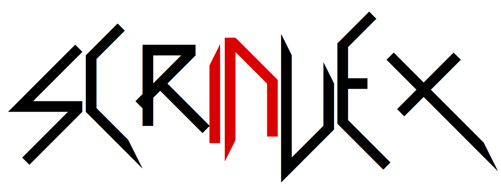

---
**Single Cell RNA Intron-Exon Counting**

`scrinvex` counts intronic, exonic, and junction-spanning reads for each unique barcode encountered in the input bam.
Each mapped read is checked against the input gtf to determine if the read lies entirely on introns, exons, or crosses at least one intron/exon junction.
Reads with the same UMI are only checked against any given gene once. Subsequent reads with the same UMI will not be checked against any gene that the first read intersected.

# Install scR-Invex

* `git clone --recursive git@github.com:broadinstitute/scrinvex.git`
    * If you do not use `--recursive` you will be missing dependencies
    * Fix with `git submodule update --init --recursive`
* `make`

### Docker Image

scR-Invex is available via `gcr.io/broad-cga-aarong-gtex/scrinvex`

# Usage

`scrinvex {gtf} {bam} [-h] [-b {barcode file}] [-q {mapping quality}] [-o {output filename}] [-s [{summary filename}]]`

### GTF

scR-Invex requires that the input GTF be collapsed in such a way that each gene
possesses only one transcript, and that there are no overlapping features on the
same strand. You can collapse existing GTFs using the [GTEx collapse annotation script](https://github.com/broadinstitute/gtex-pipeline/tree/master/gene_model)

### BAM

scR-Invex can read SAM, BAM, and, if the genome exists in your htscache, CRAM formats.
The input sequence file does not need to be indexed, but scR-Invex requires that the
file be sorted.

### Barcodes

scR-Invex can read a `barcodes.tsv` file, which is produced by cellranger by default.
The file should be a list of barcodes with one barcode on each line.
Only reads with a barcode listed in the file will be considered.

## Output Format

`scrinvex` produces 1 file, which defaults to `{sample name}.scrinvex.tsv`

This file contains 7 columns:
* `gene_id`
* `barcode`
* Counts of intron, junction, or exon reads for that gene id - barcode combination, respectively
* Counts of sense and antisense reads for that gene id - barcode combination, respectively
